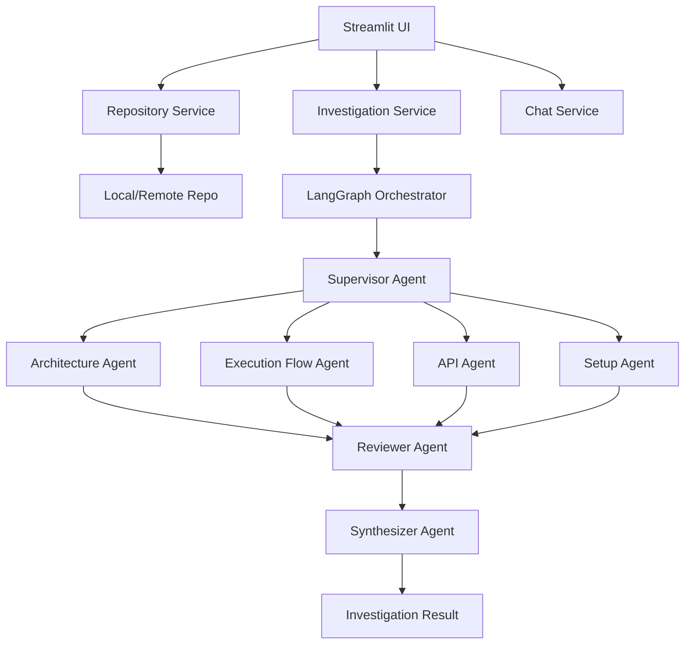

# RepoLens

RepoLens is a ReAct-based Multi-Agent Codebase Onboarding Assistant. It deeply analyses a software repository (either via GitHub URL or ZIP upload) and uses a team of specialized AI agents to generate comprehensive, tailored onboarding guides, architecture diagrams, and interactive dashboards.

## Features

- **Multi-Agent Investigation:** A LangGraph orchestrated workflow where a Supervisor agent coordinates with Specialist agents (Architecture, Execution Flow, API & Data, Setup).
- **Interactive UI:** Built with Streamlit, providing rich interactive visualizations (Dependency Graphs, Architecture Explorer, Execution Navigator).
- **Caching & History:** Revisit previously analysed repositories without re-running expensive LLM inferences.
- **Global Search:** Search through code, APIs, architecture, and chat history.
- **Export & Share:** Export findings to Markdown, JSON, or a ZIP bundle.
- **Chat Assistant:** Ask contextual questions about the repository based on the deep investigation data.
- **Plugin Architecture:** Easily extend the system with new specialized agents via the `PluginRegistry`.

## Architecture Overview

## Setup & Installation

1. Clone the repository
2. Create a virtual environment: `python -m venv venv`
3. Activate it: `source venv/bin/activate` (or `venv\Scripts\activate` on Windows)
4. Install dependencies: `pip install -r requirements.txt`
5. Copy `.env.example` to `.env` and configure your LLM provider (Ollama).
6. Run the app: `PYTHONPATH=. streamlit run app/ui/streamlit_app.py`

## Extensibility

Use the `@register_specialist_agent` decorator from `app.services.plugin_registry` to add new agents without modifying the core workflow.

## License
MIT
